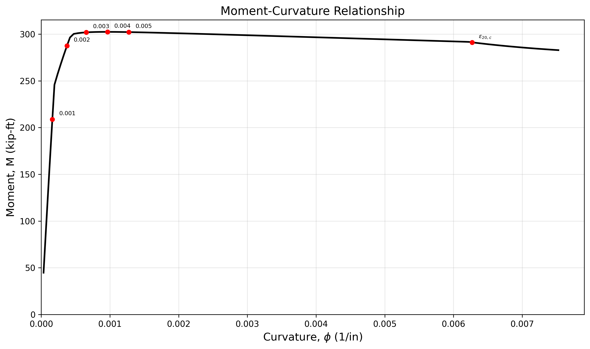

# Moment-Curvature Analysis

Live Interactive Web App: [bhosh.com/moment-curvature](https://bhosh.com/moment-curvature)

Computes the moment-curvature (M-phi) relationship for a confined rectangular RC section using the Kent & Park (1971) and Modified Kent & Park (1982) concrete models.



## Section

- 14" x 20" rectangular
- 8 #9 bars (3 top, 2 middle, 3 bottom)
- #4 ties @ 6"
- f'c = 4000 psi, fy = 60 ksi, Es = 29,000 ksi

## Three Analysis Modes

| Mode | Cover Concrete | Core Concrete | Steel |
|------|---------------|---------------|-------|
| `whole` | Confined | Confined | Elastic-perfectly plastic |
| `split` | Unconfined (spalls) | Confined | Elastic-perfectly plastic |
| `full` | Unconfined (spalls) | Confined | Strain hardening (fsu = 90 ksi) |

## Usage

```bash
pip install -r requirements.txt

python moment_curvature.py                # runs all three modes
python moment_curvature.py --mode whole   # single mode
python moment_curvature.py --mode all --no-plot  # headless, saves PNGs and CSVs
```

## Output

- Console: parameter summary + results table at key strains
- `src/`: PNG plots and CSV data files (for pgfplots or web app)

## Author

Bhoshaga Mitrran Ravi Chandran — [bhosh.com](https://bhosh.com)
